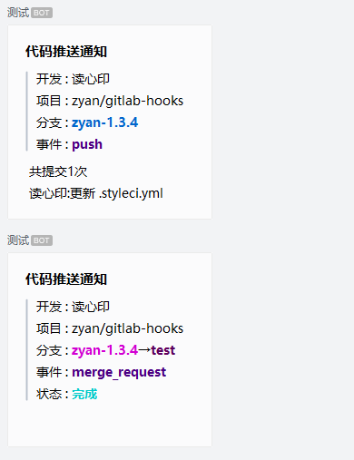
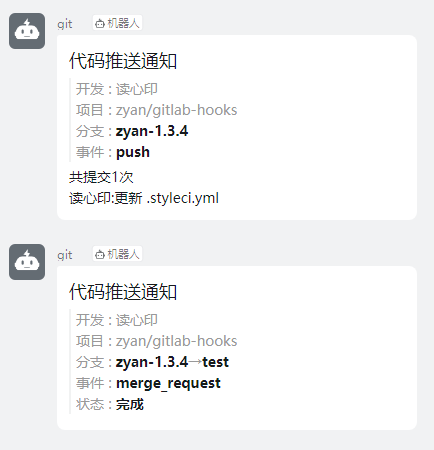

# zyan/gitlab-hooks

gitlab消息推送 转发给 企业微信与钉钉

- [x] 企业微信群机器人    
- [x] 钉钉群机器人

注:钉钉群请添加一个自定义机器人 关健词为: git

企业微信效果图



钉钉效果图




## 要求

1. php >= 7.2
2. Composer


## 安装

```shell
composer require zyan/gitlab-hooks -vvv
```

## 开始

以laravel为例,创建一个新的控制器 路由为 /test/gitlab   
将url填到gitlab系统钩子

```php

namespace App\Http\Controllers;

use App\Http\Controllers\Controller;
use Zyan\GitlabHooks;

class Test extends Controller
{
    public function gitlab()
    {
        $gitlab = new GitlabHooks();
        
        //转发给企业微信群机器人
        $res = $gitlab->sendToWeWork('您的企业微信群机器人key');
        
        //转发给钉钉群机器人
        //$res = $gitlab->sendToDingTalk('您的钉钉群机器人access_token');
        
        return response()->json($res->getBody()->getContents());
    }
}
```

## 进阶

```php

namespace App\Http\Controllers;

use App\Http\Controllers\Controller;
use Zyan\GitlabHooks;

class Test extends Controller
{
    public function gitlab()
    {
        //定制多个仓库发送不同的群
        $config =[
            //把仓库1跟仓库2发送到群1
            [   
                'project' => ['仓库1','仓库2'],
                'key' => '群1_key',
                'is_ta_all' => false, //是否@全体成员
                'at_userids' => [], //需要@成员的userid
                'at_mobiles' => [], //需要@成员的手机号
            ],
            //把仓库2跟仓库3发送到群2
            [
                'project' => ['仓库3','仓库4'],
                'key' => '群2_key',
                'is_ta_all' => false, //是否@全体成员
                'at_userids' => [], //需要@成员的userid
                'at_mobiles' => [], //需要@成员的手机号
            ],
            //...
        ];
        
        $gitlab = new GitlabHooks($config);
        
        //发送到企业微信群机器人
        $res = $gitlab->app('wework')->send();
        
        //发送到钉钉群机器人
        //$res = $gitlab->app('dingtalk')->send();
    
        //如果同时发送给多个群,则返顺多个送发结果
        return response()->json($res);
    }
}
```


## 参与贡献

1. fork 当前库到你的名下
2. 在你的本地修改完成审阅过后提交到你的仓库
3. 提交 PR 并描述你的修改，等待合并

## License

[MIT license](https://opensource.org/licenses/MIT)
